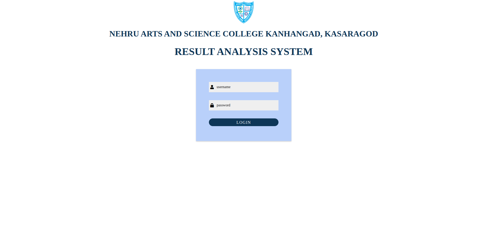
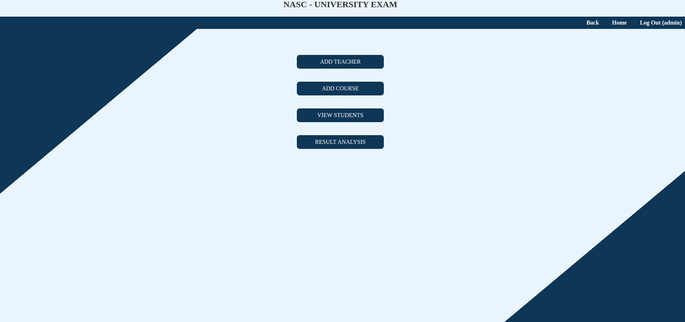
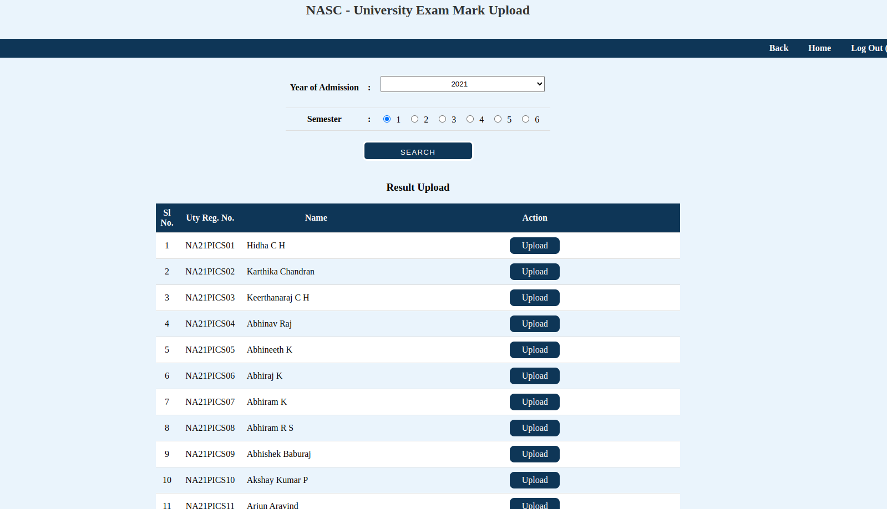
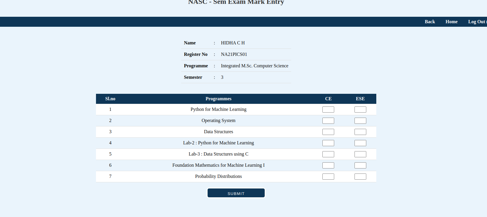
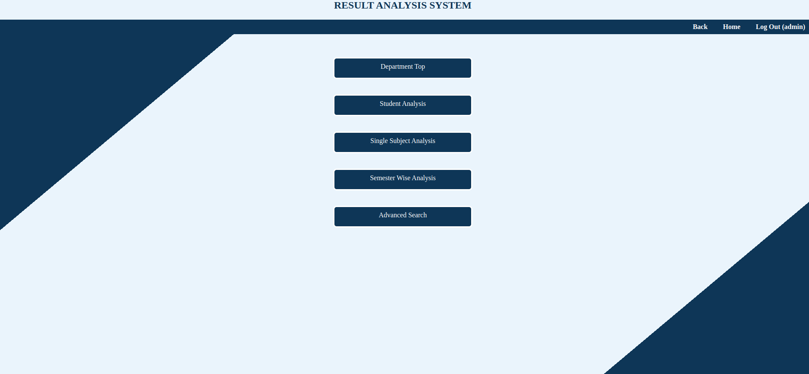
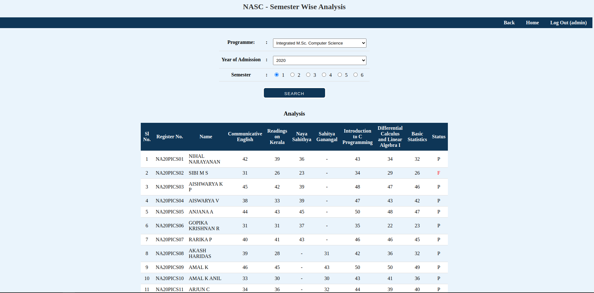
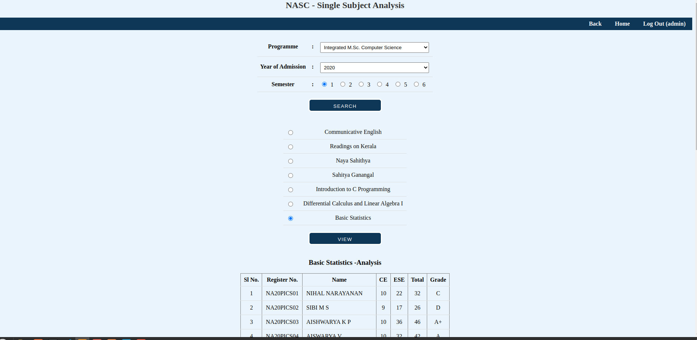
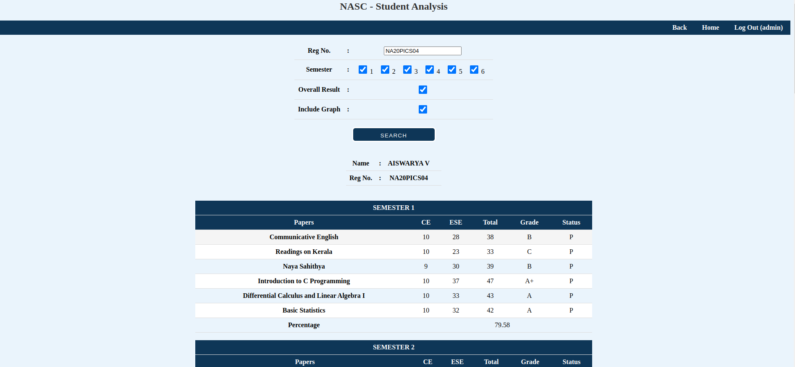
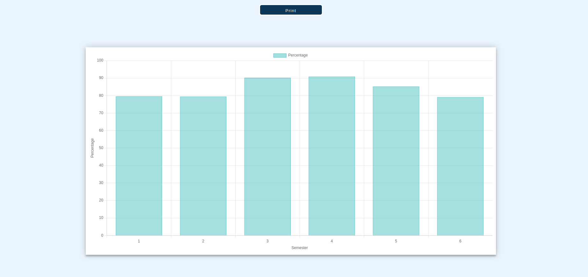
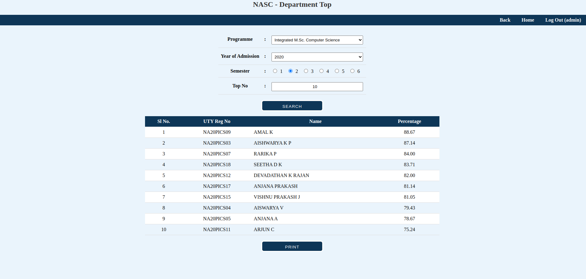

# Result Analysis System

## Introduction

The Result Analysis System is a powerful, centralized solution designed to revolutionize how academic institutions assess and monitor student progress. By automating the process of result upload and analysis, our system offers a comprehensive toolset for educators and administrators to gain valuable insights into student performance.

### Screenshots

<table>
  <tr>
    <td></td>
    <td></td>
  </tr>
  <tr>
    <td></td>
    <td></td>
  </tr>
  <tr>
    <td></td>
    <td></td>
  </tr>
  <tr>
    <td></td>
    <td></td>
  </tr>
  <tr>
    <td></td>
    <td></td>
  </tr>
  <tr>
    <td></td>
    <td></td>
  </tr>
</table>


### Tools
|  |  |  | |
|---|---|---|---|
|   |  |

## Installation and Setup

This project is designed to run locally using Apache web server and the computer's var directory.

1. Install Apache web server (if not already installed):
```bash
    sudo apt-get install apache2
```
2. Clone the repository
```bash
     git clone  https://github.com/Anjana2002/Result_Analysis_System.git
```
3. Navigate to Apache's web root directory:
```bash
    cd /var/www/html/result
```
4. Access the system through web browser:
```bash
    http://localhost/result
```
### Key Features

- Effortless result upload for departmental teachers
- Automated generation of multifaceted analyses
- Identification of top-performing students
- In-depth single-subject analysis
- Individual and semester-wise performance evaluation
- Departmental excellence assessment
- Advanced search functionality for result retrieval
- Access to historical academic data


